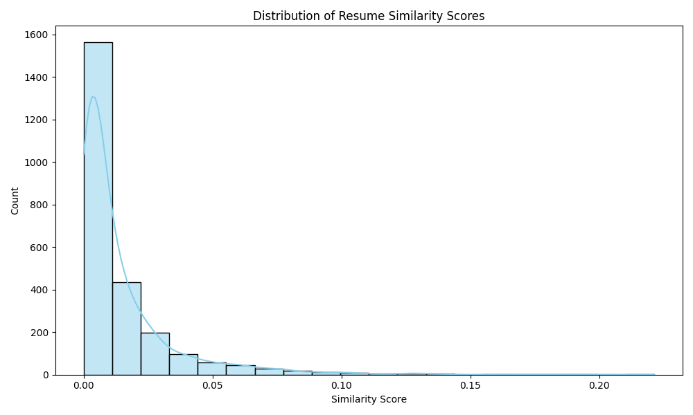
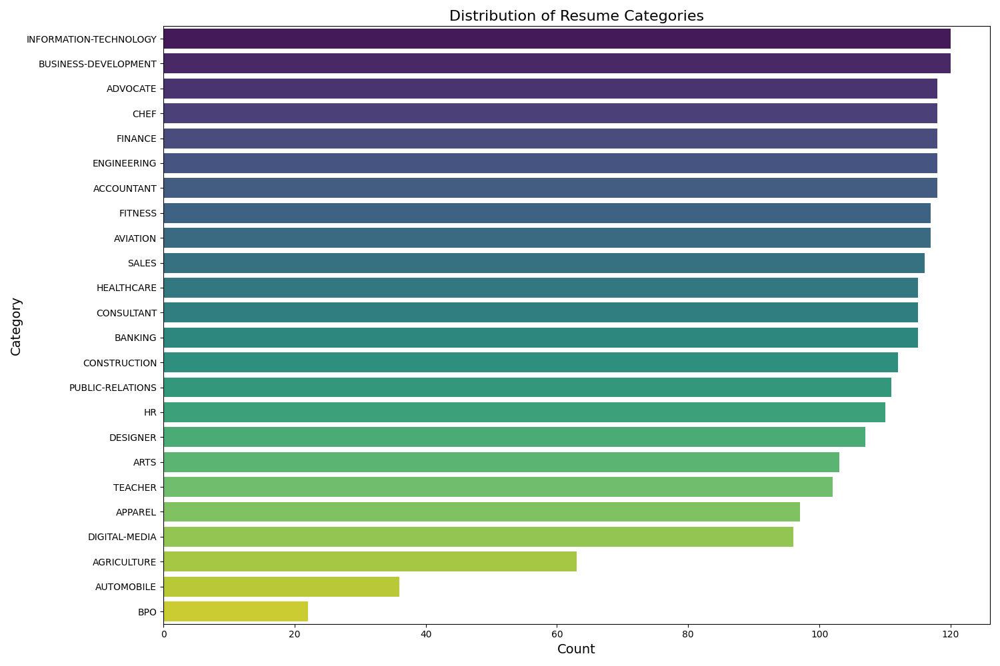

# Resume Screening System

## Overview

This project implements a Machine Learning system designed to screen and rank resumes against a specific job description. It helps automate the initial screening process by ranking candidates based on the relevance of their resumes to the job requirements.

## Features

- **Data Loading:** Imports resume data from a CSV file.
- **Text Cleaning & Preprocessing:** Removes noise such as URLs, HTML tags, special characters, and stopwords to prepare text for analysis.
- **Skill Extraction:** Identifies and extracts key technical skills (e.g., Python, SQL, Machine Learning) from resumes.
- **Job Description Parsing:** Processes and cleans the input job description.
- **Similarity Scoring:** Uses **TF-IDF (Term Frequency-Inverse Document Frequency)** vectorization and **Cosine Similarity** to calculate a relevance score for each resume against the job description.
- **Candidate Ranking:** Ranks candidates based on their similarity scores.
- **Gap Analysis:** Identifies which required skills are missing from the top-ranked candidates.
- **Visualization:** Visualizes the distribution of similarity scores across all candidates.

## Prerequisites

Ensure, you have the following Python libraries installed:

- `pandas`
- `numpy`
- `scikit-learn`
- `nltk`
- `matplotlib`
- `seaborn`
- `spacy`

You can install them using:

```bash
pip install pandas numpy scikit-learn nltk matplotlib seaborn spacy
```

## Usage

1.  **Prepare Data:** Ensure you have a `resume.csv` file in the project directory containing the resume data. The dataset should have a column named `Resume_str` or `Resume`.
2.  **Run the Notebook:** Open `resume_screening.ipynb` in Jupyter Notebook or JupyterLab.
3.  **Execute Cells:** Run the cells sequentially to load data, preprocess text, and perform the analysis.
4.  **Custom Job Description:** You can modify the `job_description` variable in the "Job Description Parsing" section to test against different roles.

## Project Structure

- `resume_screening.ipynb`: The main Jupyter Notebook containing the code and logic.
- `resume.csv`: The dataset containing resume text (ensure this file is present).

## Visualizations

The project includes advanced visualizations to provide insights into the resume data:

### Distribution of Resume Similarity Scores

This histogram shows how the similarity scores of the resumes are distributed, indicating the overall relevance of the candidate pool to the job description.



### Distribution of Resume Categories

This bar chart displays the count of resumes in each job category, helping to understand the dataset's composition.


